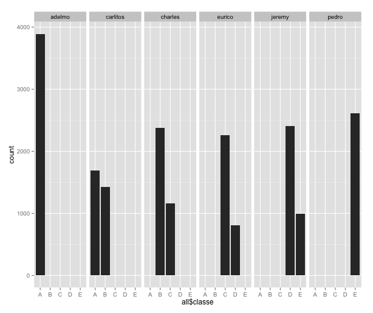

# Project : Practical Machine Learning
These are the various stages of analysis

## Exploratory Analysis
The data is voluminious but it is for a small group of users and for a few instances of use.

After the exploratory analysis it is did not appear that it would make sense to impute most of the missing data. The plots were created in one shot and examined in just the finder preview (the [exploratory plots are here in the `figures` folder](/figures))

```{r}
  for (i in 1:ncol(x)) {
    png(paste0("Plot",i,".png"), height=480, width=480)
    print(qplot(data=x,x[,i],xlab=names(x)[i]))
    dev.off()
  }
```
Notably, the few number of users and the activities by each (which had an effect on the features used for modelling)



The clean-up and feature reduction entailed

  * Dropping columns with needless factor
  * Dropping features with less than 5% data
  * Dropping features with more than 95% NA
  * Remove features that were more than 0.7 correlated

```{r}
# Clean it up a bit
all=all[,-which(names(all) %in% c('X','cvtd_timestamp'))]   # remove the serial # and useless factor variables
all=all[,colSums(!is.na(all))/nrow(all) > .95]              # remove columns with high NA
all=all[,colSums(all!="")/nrow(all) > .95]                  # remove columns with high blanks
cm=cor(all[,!sapply(all,is.factor)])                        # find correlation between features
all=all[,-findCorrelation(cm,.70,verbose = F)]              # remove correlated columns
```

## Cross-validation
I ran several models with pulling out validation sets from the training set and found little difference in the model parameters (both for trees and GLM). In fact, in the end the best cross validation was achieved using a random forest [see section on Prediction below].

## Fitting models
The models used were

1. **GLM** - when trained against all parameter and then reduced by stepwise elimination of features, the models all ended up using the user_name and timestamp. Though the test set also has the same users and time periods, it just did not seem right. So for GLM and all other models, these three features were excluded.
2. **Classification tree** - the accuracy (or any other predictive measure) were quite bad
3. **Random Forest** - this was the best option in the end

The code used

*GLM* - needed to break-up the `classe` factor variable into separate one for binomial GLM models.
```{r}
# Create columns for each factor level for classe
all$A=ifelse(all$classe=='A',1,0)
all$B=ifelse(all$classe=='B',1,0)
all$C=ifelse(all$classe=='C',1,0)
all$D=ifelse(all$classe=='D',1,0)
all$E=ifelse(all$classe=='E',1,0)

# Split the data
split = createDataPartition(all$classe, p=0.4, list=F)
d = all[split,]
v = all[-split,]

# fit GLMs
mA = glm(A~.-classe-B-C-D-E-user_name-raw_timestamp_part_1-raw_timestamp_part_2, data = d, family="binomial")
mA = step(mA)
mB = glm(B~.-classe-A-C-D-E-user_name-raw_timestamp_part_1-raw_timestamp_part_2, data = d, family="binomial")
mB = step(mB)
mC = glm(C~.-classe-A-B-D-E-user_name-raw_timestamp_part_1-raw_timestamp_part_2, data = d, family="binomial")
mC = step(mC)
mD = glm(D~.-classe-A-B-C-E-user_name-raw_timestamp_part_1-raw_timestamp_part_2, data = d, family="binomial")
mD = step(mD)
mE = glm(E~.-classe-A-B-C-D-user_name-raw_timestamp_part_1-raw_timestamp_part_2, data = d, family="binomial")
mE = step(mE)
```
*Classification Tree*

```{r}
# fit a tree
mt = train(classe~.-A-B-C-D-E-user_name-raw_timestamp_part_1-raw_timestamp_part_2,data=d,method="rpart")
```
*Random Forest*

```{r}
# fit a forest
mf = randomForest(classe~.-A-B-C-D-E-user_name-raw_timestamp_part_1-raw_timestamp_part_2, data = d)
```
## Prediction
### Validation set
The results on the validation set

```{r}
# GLMs
> pglm=data.frame(predict(mA,newdata=nd),predict(mB,newdata=nd),predict(mC,newdata=nd),predict(mD,newdata=nd),predict(mE,newdata=nd))
> names(pglm)=c("A","B","C","D","E")
> pglm$predict=(names(pglm)[max.col(pglm)])
> confusionMatrix(pglm$predict,nd$classe)
Confusion Matrix and Statistics

          Reference
Prediction    A    B    C    D    E
         A 2589  398  459  186  251
         B  259 1171  129  193  292
         C  215  285 1198  213  186
         D  219  160  156 1170  227
         E   66  264  111  167 1208

Overall Statistics

               Accuracy : 0.6232
                 95% CI : (0.6143, 0.6319)
    No Information Rate : 0.2844
    P-Value [Acc > NIR] : < 2.2e-16

                  Kappa : 0.5207
 Mcnemar's Test P-Value : < 2.2e-16

Statistics by Class:

                     Class: A Class: B Class: C Class: D Class: E
Sensitivity            0.7733  0.51405   0.5835  0.60653   0.5582
Specificity            0.8464  0.90805   0.9075  0.92258   0.9367
Pos Pred Value         0.6668  0.57290   0.5713  0.60559   0.6652
Neg Pred Value         0.9038  0.88620   0.9116  0.92287   0.9040
Prevalence             0.2844  0.19351   0.1744  0.16386   0.1838
Detection Rate         0.2199  0.09947   0.1018  0.09939   0.1026
Detection Prevalence   0.3299  0.17363   0.1781  0.16412   0.1543
Balanced Accuracy      0.8098  0.71105   0.7455  0.76456   0.7475
```

```{r}
# Classification tree
> confusionMatrix(predict(mt,newdata=nd),nd$classe)
Confusion Matrix and Statistics

          Reference
Prediction    A    B    C    D    E
         A 2753  338   30  156  160
         B   89  832   87  379  447
         C  504 1104 1936 1230  837
         D    0    0    0    0    0
         E    2    4    0  164  720

Overall Statistics

               Accuracy : 0.5302
                 95% CI : (0.5211, 0.5392)
    No Information Rate : 0.2844
    P-Value [Acc > NIR] : < 2.2e-16

                  Kappa : 0.4051
 Mcnemar's Test P-Value : < 2.2e-16

Statistics by Class:

                     Class: A Class: B Class: C Class: D Class: E
Sensitivity            0.8223  0.36523   0.9430   0.0000  0.33272
Specificity            0.9188  0.89446   0.6219   1.0000  0.98231
Pos Pred Value         0.8010  0.45365   0.3450      NaN  0.80899
Neg Pred Value         0.9286  0.85450   0.9810   0.8361  0.86730
Prevalence             0.2844  0.19351   0.1744   0.1639  0.18383
Detection Rate         0.2339  0.07068   0.1645   0.0000  0.06116
Detection Prevalence   0.2920  0.15579   0.4766   0.0000  0.07560
Balanced Accuracy      0.8705  0.62985   0.7824   0.5000  0.65751
```

```{r}
# Forest
> confusionMatrix(predict(mf,newdata=nd),nd$classe)
Confusion Matrix and Statistics

          Reference
Prediction    A    B    C    D    E
         A 3346    2    0    0    0
         B    2 2258   18    0    0
         C    0   18 2033   26    1
         D    0    0    2 1899    7
         E    0    0    0    4 2156

Overall Statistics

               Accuracy : 0.9932
                 95% CI : (0.9915, 0.9946)
    No Information Rate : 0.2844
    P-Value [Acc > NIR] : < 2.2e-16

                  Kappa : 0.9914
 Mcnemar's Test P-Value : NA

Statistics by Class:

                     Class: A Class: B Class: C Class: D Class: E
Sensitivity            0.9994   0.9912   0.9903   0.9844   0.9963
Specificity            0.9998   0.9979   0.9954   0.9991   0.9996
Pos Pred Value         0.9994   0.9912   0.9783   0.9953   0.9981
Neg Pred Value         0.9998   0.9979   0.9979   0.9970   0.9992
Prevalence             0.2844   0.1935   0.1744   0.1639   0.1838
Detection Rate         0.2842   0.1918   0.1727   0.1613   0.1831
Detection Prevalence   0.2844   0.1935   0.1765   0.1621   0.1835
Balanced Accuracy      0.9996   0.9946   0.9928   0.9918   0.9979
```

### Test set
Given the results on the validation set, using random forest to predict the test set

```{r}
   user_name   cvtd_timestamp prediction
1      pedro 05/12/2011 14:23          B
2     jeremy 30/11/2011 17:11          A
3     jeremy 30/11/2011 17:11          B
4     adelmo 02/12/2011 13:33          A
5     eurico 28/11/2011 14:13          A
6     jeremy 30/11/2011 17:12          E
7     jeremy 30/11/2011 17:12          D
8     jeremy 30/11/2011 17:11          B
9   carlitos 05/12/2011 11:24          A
10   charles 02/12/2011 14:57          A
11  carlitos 05/12/2011 11:24          B
12    jeremy 30/11/2011 17:11          C
13    eurico 28/11/2011 14:14          B
14    jeremy 30/11/2011 17:10          A
15    jeremy 30/11/2011 17:12          E
16    eurico 28/11/2011 14:15          E
17     pedro 05/12/2011 14:22          A
18  carlitos 05/12/2011 11:24          B
19     pedro 05/12/2011 14:23          B
20    eurico 28/11/2011 14:14          B
```

## Conclusion

Clearly the benefit of cross-validation is evident in the accuracy of the random forest (at least on the validation set)

